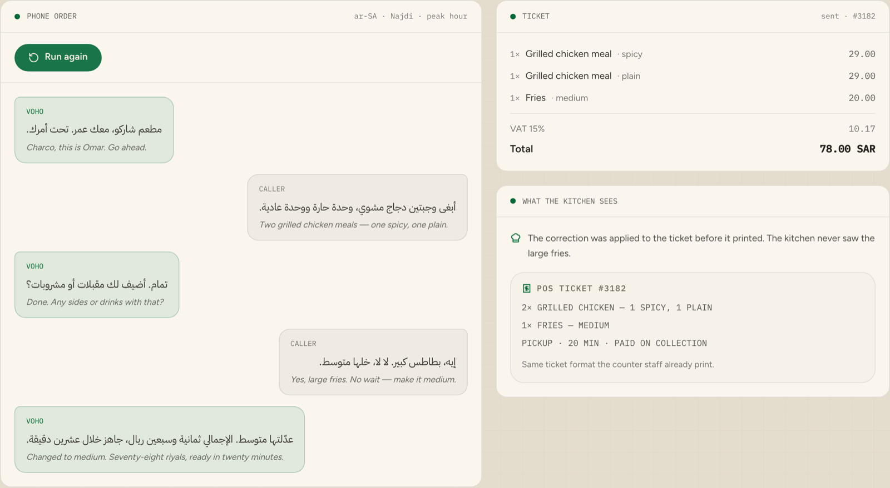

# Charco Voice Agent — Najdi

> Takes restaurant orders over the phone in Saudi Arabic, prices them, and sends the ticket to the kitchen.

Built for Saudi Arabia. The agent takes the order in **Najdi Arabic** — the
dialect of Riyadh and central Saudi Arabia — including the way people actually
order, changing their mind halfway through.

<p align="center">
  <a href="https://voho.ai/demos/restaurant-ordering">
    
  </a>
</p>

<p align="center">
  <b><a href="https://voho.ai/demos/restaurant-ordering">▶ Play the live demo</a></b> — runs in your browser, no sign-up.
</p>

<!-- voho:try -->
## Try it in your browser first

You do not have to clone anything to see whether this works for you. The same
engine this repository calls is running at **[app.voho.ai/agents](https://app.voho.ai/agents)** —
build an agent and talk to it out loud, in the browser, in about a minute.

New accounts start with **$25 of credit**, and one balance and one API key
cover every Voho product: AI Call Center, and the five beside it.

- **[Build an agent and talk to it out loud →](https://app.voho.ai/agents)**
- [Get an API key](https://app.voho.ai/tokens) — the key this repository needs
- [Read the API docs](https://docs.voho.ai)

Running it inside your own estate, against your own systems, is what we do
with you: [talk to us](https://voho.ai/book-demo).

---

---

## The hard part is the correction

Adding items is easy. This is what a real order sounds like:

> إيه، بطاطس كبير. **لا لا، خلها متوسط**
> *Yes, large fries. No wait — make it medium.*

One utterance containing an item, an option, a retraction and a replacement.
Handle it by appending and the kitchen cooks two portions of fries. So
[`order.py`](order.py) can amend the last line and reprice it, and
[`intents.py`](intents.py) tells the two cases apart:

| What the caller says | What it means | Why |
| --- | --- | --- |
| وحدة حارة ووحدة عادية | **Two lines**, one spicy one plain | Two portions, cooked differently |
| بطاطس كبير، لا لا متوسط | **One line**, medium | A retraction word sits between the two sizes |

Both look identical to a matcher that only records which words appeared. The
order they were said in is the entire signal.

## Two ways to run this

**Let Voho be the whole agent.** A Voho voice agent answers the line, hears the
caller in Saudi Arabic, works out what they actually want, takes the action in
your systems, stops talking the moment it is interrupted, hands over to a
person when it should, and leaves a bilingual transcript and summary behind.
Hearing, deciding and speaking are all Voho's — you configure the agent and its
actions rather than writing any of this. It is the fastest route to a live
line.

**Or assemble it yourself, the way this repository does.** Here the
conversation lives in code you can read line by line, the tools are yours, and
Voho's Speech API provides the voice. Worth it when the script has to be
reviewed before it goes anywhere near a caller, or when every part has to sit
inside your own network.

| Part | In this repository | With a Voho agent |
| --- | --- | --- |
| Hearing the caller | whichever recogniser you point [`stt.py`](stt.py) at | Voho |
| Deciding what to do | menu matching in [`intents.py`](intents.py) | Voho |
| Acting in your systems | [`order.py`](order.py), into your POS | Voho actions, calling your API |
| Speaking | Voho, via [`voho.py`](voho.py) | Voho |
| Transcript and summary | yours to keep | Voho, in Arabic and English |

Both end in the same place. Start with whichever suits the team you have.

## Quick start

You need a Voho API key — `setup.py` walks you through getting one at
[app.voho.ai](https://app.voho.ai) under **API Tokens**, checks it against the
live voice catalogue so a typo fails now rather than on a call, and writes it
to `.env`.

```bash
git clone https://github.com/yar-malik/charco-voice-agent-najdi.git
cd charco-voice-agent-najdi
pip install -r requirements.txt
python setup.py           # asks for your Voho key and verifies it
```

### In the terminal

```bash
python examples/cli.py
```

```
  Voho  مطعم شاركو، معك عمر. تحت أمرك.
Caller  أبغى وجبتين دجاج مشوي، وحدة حارة ووحدة عادية
  Voho  تمام. أضيف لك مقبلات أو مشروبات؟
Caller  إيه، بطاطس كبير. لا لا، خلها متوسط
  Voho  طلبك: وجبة دجاج مشوي حار، ووجبة دجاج مشوي عادي، وبطاطس متوسط. الإجمالي 78.00 ريال.
```

Every reply is synthesised to `out/`. Add `--silent` to skip that.

### With a UI

```bash
streamlit run ui.py
```

Type in Arabic, hear the reply, watch the ticket build beside it. This is the
one to hand to someone who needs to tell you whether the agent understood them.

### On a real number

```bash
export PUBLIC_URL=https://your-tunnel.ngrok.io
python app.py
```

Point a Twilio number's **Voice** webhook at `POST /voice`. Finished tickets go
to `POS_URL` if you set it, and are always readable at `GET /api/orders`.

## The menu

[`menu.json`](menu.json) holds the items, their prices, their options and the
phrases callers use. Nothing else needs editing to change what is on sale:

```json
{
  "sku": "SD-01", "name_ar": "بطاطس", "name_en": "Fries", "price": 14.00,
  "says": ["بطاطس", "بطاطا", "fries"],
  "options": {
    "size": {
      "says_ar": { "صغير": "small", "متوسط": "medium", "كبير": "large" },
      "label_ar": { "small": "صغير", "medium": "متوسط", "large": "كبير" },
      "price_delta": { "small": -4.00, "medium": 6.00, "large": 10.00 }
    }
  }
}
```

`says_ar` maps speech to a value; `label_ar` maps it back for the read-back.
Both directions are needed — the option values are English identifiers, and
reading "medium" out loud in the middle of an Arabic sentence is exactly the
kind of thing that tells a caller they are talking to a machine.

## VAT

Prices are VAT-inclusive, the way they are displayed in Saudi Arabia. The VAT
line on the ticket is the tax **already contained in** the total, not something
added on top of it:

```
78.00 SAR total  →  VAT 15% = 78.00 − 78.00 / 1.15 = 10.17
```

Get that backwards and every ticket is wrong by 15%.

## Running inside your own network

Point `VOHO_BASE_URL` at your own deployment and set `STT_PROVIDER=custom` with
`STT_URL` pointing at a self-hosted recogniser. Nothing else changes.

## Security

- No key is committed. `.env` is git-ignored; `.env.example` holds placeholders only.
- Synthesised clips are held in memory against a random id and dropped after one play.
- A failed POS submission is logged, never retried into a duplicate order.

## More Voho examples

| Repository | What it covers | Live demo |
| --- | --- | --- |
| [charco-voice-agent-najdi](https://github.com/yar-malik/charco-voice-agent-najdi) | Taking restaurant orders by phone | [Play it](https://voho.ai/demos/restaurant-ordering) |
| [ai-voice-agent-saudi-najdi](https://github.com/yar-malik/ai-voice-agent-saudi-najdi) | Booking appointments by phone | [Play it](https://voho.ai/demos/appointment-booking) |
| [realtime-arabic-voice-agent-najdi](https://github.com/yar-malik/realtime-arabic-voice-agent-najdi) | Streaming answers from your own documents | [Play it](https://voho.ai/demos/realtime-arabic-rag) |
| [saudi-arabic-voice-agent](https://github.com/yar-malik/saudi-arabic-voice-agent) | Phone agents in Najdi Arabic | [Play it](https://voho.ai/demos/ai-call-center) |
| [arabic-voice-dictation-enterprise](https://github.com/yar-malik/arabic-voice-dictation-enterprise) | Speaking instead of typing | [Play it](https://voho.ai/demos/ai-voice-assistant) |

## Want this in production?

We build the first workflow with you, on your own systems — usually live
within a month.

**[Book a call →](https://voho.ai/book-demo)**

---

MIT licensed. Built by [Voho](https://voho.ai) — enterprise AI for Saudi Arabia.
